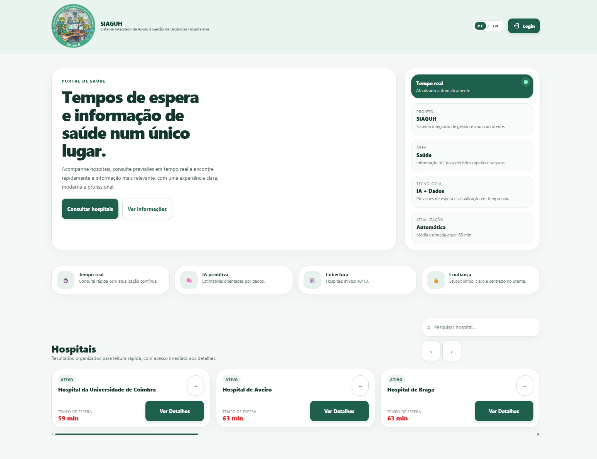
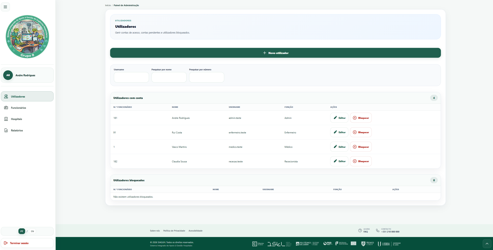
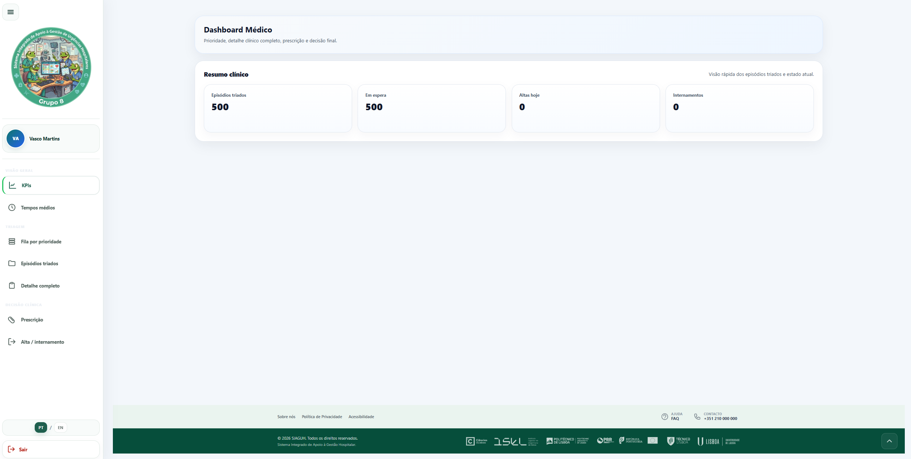
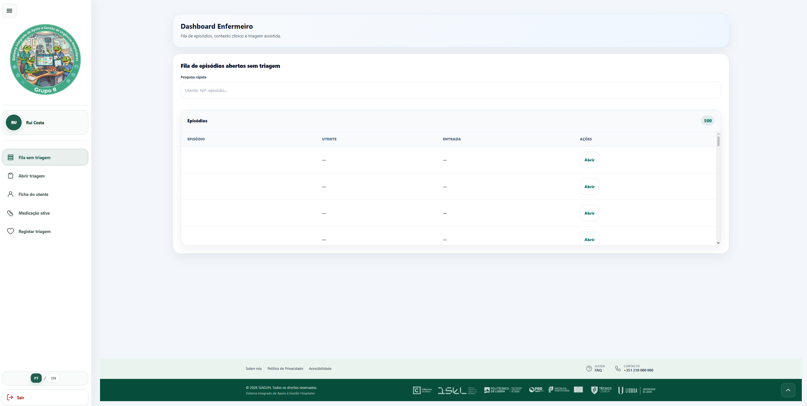
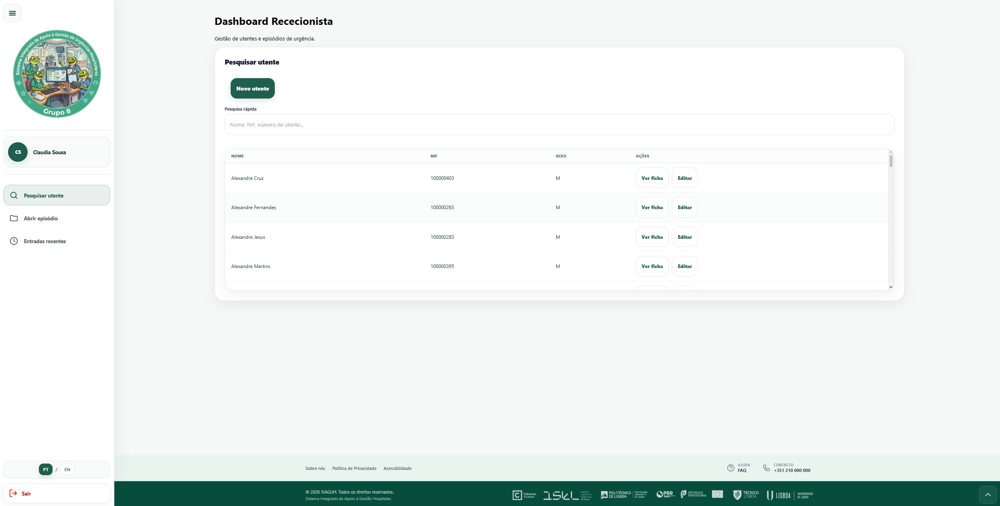
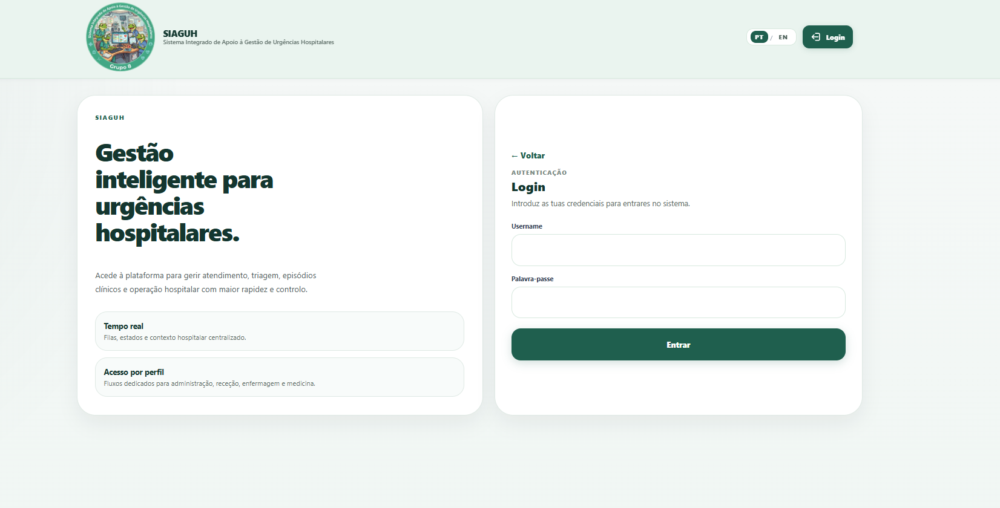
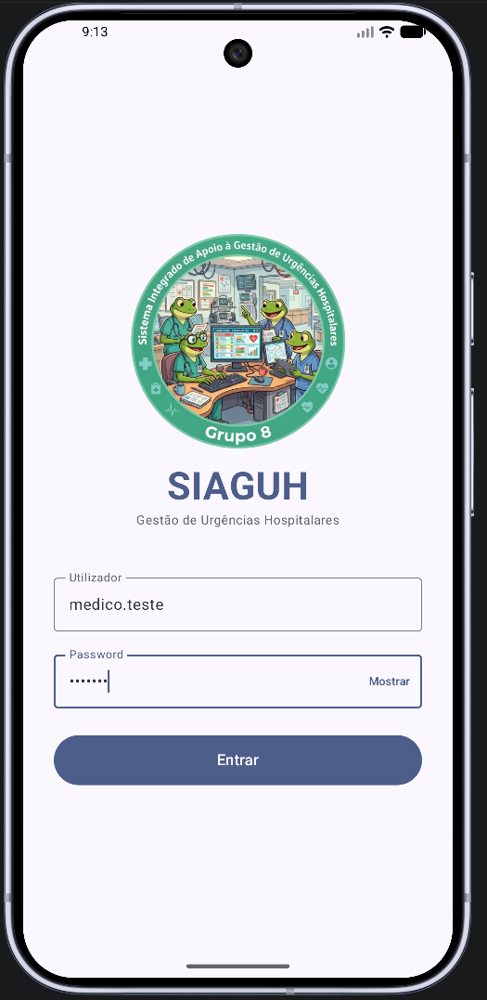

# 🏥 SIAGUH — Sistema Integrado de Apoio à Gestão de Urgências Hospitalares

Sistema Integrado de Apoio à Gestão de Urgências Hospitalares desenvolvido pelo **Grupo 8** no âmbito do Projeto Integrador da pós-graduação PRODIGI.

O SIAGUH é uma plataforma hospitalar moderna focada na gestão clínica, administrativa e operacional de serviços de urgência, integrando tecnologias web modernas, autenticação segura, dashboards por perfil e módulos de Inteligência Artificial para apoio à decisão clínica.

---


## 🧭 Índice
- [Estado Atual do Projeto](#estado-atual-do-projeto)
- [Roadmap e Próximos Passos](#roadmap-e-próximos-passos)
- [Objetivo do Projeto](#objetivo-do-projeto)
- [URLs do Projeto](#urls-do-projeto)
- [Estrutura Geral do Repositório](#estrutura-geral-do-repositório)
- [Backend FastAPI](#backend-fastapi)
- [Inteligência Artificial](#inteligência-artificial)
- [Frontend Web](#frontend-web)
- [Android](#android)
- [Autenticação e Segurança](#autenticação-e-segurança)
- [Tecnologias Utilizadas](#tecnologias-utilizadas)
- [Grupo 8](#grupo-8)
- [Conclusão](#conclusão)

## 📊 Estado Atual do Projeto

| Módulo | Estado |
|---|---|
| Backend FastAPI | 🔄 Em desenvolvimento |
| Base de Dados PostgreSQL | 🟢 Implementado |
| Inteligência Artificial | 🟢 Funcional |
| Frontend Web React | 🟢 Funcional |
| Android App | 📋 Planeado |
| Dockerização | 🟡 Parcial |
| Autenticação JWT | 🟢 Implementada |
| Dashboards por Perfil | 🟢 Implementados |

## 🗺️ Roadmap e Próximos Passos

- [ ] Aplicação Android.
- [ ] Dockerização completa.
- [ ] Deploy cloud.
- [ ] Integração CI/CD.
- [ ] Monitorização do sistema.
- [ ] Sistema de notificações.
- [ ] Relatórios avançados.
- [ ] Expansão dos modelos IA.
- [ ] Integração com dispositivos hospitalares.
- [ ] Dashboard analítico avançado.

## 🎯 Objetivo do Projeto

Desenvolver uma plataforma hospitalar moderna capaz de:

- Melhorar a gestão das urgências.
- Automatizar processos clínicos.
- Apoiar decisões médicas.
- Utilizar Inteligência Artificial em contexto hospitalar.
- Reduzir tempos de espera.
- Melhorar a segurança medicamentosa.

## 🔗 URLs do Projeto

### Frontend

```text
http://localhost:5173
```

### ⚙️ Backend API

```text
http://localhost:8000
```

### Swagger Backend

```text
http://localhost:8000/docs
```

### IA API

```text
http://localhost:8001
```

### Swagger IA

```text
http://localhost:8001/docs
```

## 🏗️ Estrutura Geral do Repositório

```text
SIAGUH/
│
├── .venv/
│
├── android/
│   └── .gitkeep
│
├── backend/
│   ├── __pycache__/
│   ├── auth/
│   ├── dao/
│   ├── repositories/
│   ├── routers/
│   ├── schemas/
│   ├── scripts/
│   ├── services/
│   ├── SQL/
│   │
│   ├── __init__.py
│   ├── .gitkeep
│   ├── db.py
│   ├── main.py
│   └── requirements.txt
│
├── docs/
│
├── ia/
│   ├── data/
│   │   ├── processed/
│   │   └── raw/
│   │
│   ├── models/
│   ├── src/
│   │
│   ├── .gitkeep
│   ├── Dockerfile
│   ├── Installation guide.txt
│   ├── main_ai.py
│   └── requirements.txt
│
├── web/
│   ├── node_modules/
│   │
│   ├── public/
│   │   └── favicon.svg
│   │
│   ├── src/
│   │   ├── app/
│   │   ├── components/
│   │   ├── constants/
│   │   ├── contexts/
│   │   ├── imagens/
│   │   ├── locals/
│   │   ├── pages/
│   │   ├── services/
│   │   ├── styles/
│   │   └── main.jsx
│   │
│   ├── index.html
│   ├── package-lock.json
│   ├── package.json
│   ├── README.md
│   ├── tailwind.config.js
│   └── vite.config.js
│
├── .dockerignore
├── .env
├── .env.example
├── .gitignore
├── diagrama.html
├── docker-compose.yml
├── Dockerfile
├── estrutura.txt
├── package-lock.json
├── package.json
└── README.md
```

## ⚙️ Backend FastAPI

O backend do SIAGUH foi desenvolvido em **FastAPI**, seguindo uma arquitetura modular baseada em:

- DAO Layer.
- Repository Pattern.
- Service Layer.
- APIs REST.
- Autenticação JWT.
- Integração com PostgreSQL.
- Integração com IA.

### 🧩 Arquitetura

O backend segue uma arquitetura em camadas:

```text
router -> service -> repository -> dao -> db
```

#### 📌 Responsabilidades

##### routers
Responsáveis pelos endpoints HTTP e validação inicial.

##### services
Responsáveis pela lógica de negócio.

##### repositories
Responsáveis pela coordenação do acesso aos dados.

##### dao
Responsáveis pela execução SQL direta.

##### db.py
Responsável pela ligação centralizada ao PostgreSQL.

### 📁 Estrutura Completa do Backend

```text
backend/
│
├── __pycache__/
│
├── auth/
│   └── security.py
│
├── dao/
│   ├── __init__.py
│   ├── alergias_dao.py
│   ├── alerta_dao.py
│   ├── antecedentes_dao.py
│   ├── atos_dao.py
│   ├── episodios_dao.py
│   ├── hospitais_dao.py
│   ├── internamentos_dao.py
│   ├── logs_dao.py
│   ├── medicacaoativa_dao.py
│   ├── medicamentos_dao.py
│   ├── predicao_ia_dao.py
│   ├── prescricoes_dao.py
│   ├── profissionais_dao.py
│   ├── trabalha_dao.py
│   ├── triagens_dao.py
│   ├── utenteantecedente_dao.py
│   ├── utentes_dao.py
│   └── utilizadores_dao.py
│
├── repositories/
│   ├── __init__.py
│   ├── alergias_repository.py
│   ├── alerta_repository.py
│   ├── antecedentes_repository.py
│   ├── atos_repository.py
│   ├── episodios_repository.py
│   ├── hospitais_repository.py
│   ├── internamentos_repository.py
│   ├── medicacaoativa_repository.py
│   ├── medicamentos_repository.py
│   ├── predicao_ia_repository.py
│   ├── prescricoes_repository.py
│   ├── profissionais_repository.py
│   ├── trabalha_repository.py
│   ├── triagens_repository.py
│   ├── utenteantecedente_repository.py
│   ├── utentes_repository.py
│   └── utilizadores_repository.py
│
├── services/
│   ├── ai_espera_service.py
│   ├── ai_prescricao_service.py
│   ├── ai_triagem_service.py
│   ├── alergias_service.py
│   ├── alerta_service.py
│   ├── antecedentes_service.py
│   ├── atos_service.py
│   ├── episodios_service.py
│   ├── hospitais_service.py
│   ├── internamentos_service.py
│   ├── medicacaoativa_service.py
│   ├── medicamentos_service.py
│   ├── model_registry.py
│   ├── painel_service.py
│   ├── predicao_ia_service.py
│   ├── prescricoes_service.py
│   ├── profissionais_service.py
│   ├── trabalha_service.py
│   ├── triagens_service.py
│   ├── utenteantecedente_service.py
│   ├── utentes_service.py
│   └── utilizadores_service.py
│
├── SQL/
│   ├── createTables.sql
│   └── populateDB.sql
│
├── __init__.py
├── .gitkeep
├── db.py
├── main.py
└── requirements.txt
```

### ▶️ Como Instalar e Executar o Backend

#### 1. Entrar na pasta

```bash
cd backend
```

#### 2. Criar ambiente virtual

```bash
python -m venv .venv
```

#### 3. Ativar ambiente virtual

##### Windows

```bash
.venv\\Scripts\\activate
```

##### Linux / macOS

```bash
source .venv/bin/activate
```

#### 4. Instalar dependências

```bash
pip install -r requirements.txt
```

#### 5. Executar o servidor

```bash
uvicorn main:app --reload
```

### 🔌 Rotas e Endpoints do Backend FastAPI

---

#### 🏥 Utentes

```http
GET    /api/v1/utentes/
POST   /api/v1/utentes/
GET    /api/v1/utentes/nif/{nif}
GET    /api/v1/utentes/{num_utente}
PUT    /api/v1/utentes/{num_utente}
DELETE /api/v1/utentes/{num_utente}
```

---

#### 🚑 Episódios

```http
GET    /api/v1/episodios/
POST   /api/v1/episodios/
GET    /api/v1/episodios/utente/{num_utente}
GET    /api/v1/episodios/hospital/{id_hosp}
GET    /api/v1/episodios/{cod_ep_urgenc}
PUT    /api/v1/episodios/{cod_ep_urgenc}
DELETE /api/v1/episodios/{cod_ep_urgenc}
```

---

#### 🩺 Triagens

```http
GET    /api/v1/triagens/
POST   /api/v1/triagens/
GET    /api/v1/triagens/{cod_ep_urgenc}
PUT    /api/v1/triagens/{cod_ep_urgenc}
DELETE /api/v1/triagens/{cod_ep_urgenc}
```

---

#### 🛏️ Internamentos

```http
GET    /api/v1/internamentos/
POST   /api/v1/internamentos/
GET    /api/v1/internamentos/episodio/{cod_ep_urgenc}
GET    /api/v1/internamentos/{cod_internamento}
PUT    /api/v1/internamentos/{cod_internamento}
DELETE /api/v1/internamentos/{cod_internamento}
```

---

#### 👨‍⚕️ Profissionais

```http
GET    /api/v1/profissionais/
POST   /api/v1/profissionais/
GET    /api/v1/profissionais/{id_func}
PUT    /api/v1/profissionais/{id_func}
DELETE /api/v1/profissionais/{id_func}
```

---

#### 🧾 Atos Médicos

```http
GET    /api/v1/atos/
POST   /api/v1/atos/
GET    /api/v1/atos/episodio/{cod_ep_urgenc}
GET    /api/v1/atos/{id_ato}
PUT    /api/v1/atos/{id_ato}
DELETE /api/v1/atos/{id_ato}
```

---

#### 💊 Prescrições

```http
GET    /api/v1/prescricoes/
POST   /api/v1/prescricoes/
GET    /api/v1/prescricoes/ato/{id_ato}
GET    /api/v1/prescricoes/{id_prescricao}
PUT    /api/v1/prescricoes/{id_prescricao}
DELETE /api/v1/prescricoes/{id_prescricao}
```

---

#### 🏥 Hospitais

```http
GET    /api/v1/hospitais/
POST   /api/v1/hospitais/
GET    /api/v1/hospitais/{id_hosp}
PUT    /api/v1/hospitais/{id_hosp}
DELETE /api/v1/hospitais/{id_hosp}
```

---

#### 💉 Medicamentos

```http
GET    /api/v1/medicamentos/
POST   /api/v1/medicamentos/
GET    /api/v1/medicamentos/{cod_medicamento}
PUT    /api/v1/medicamentos/{cod_medicamento}
DELETE /api/v1/medicamentos/{cod_medicamento}
```

---

#### 👤 Utilizadores

```http
GET    /api/v1/utilizadores/
POST   /api/v1/utilizadores/
GET    /api/v1/utilizadores/username/{username}
GET    /api/v1/utilizadores/{id_func}
PUT    /api/v1/utilizadores/{id_func}
DELETE /api/v1/utilizadores/{id_func}
```

---

#### 🏢 Trabalha

```http
GET    /api/v1/trabalha/
POST   /api/v1/trabalha/
GET    /api/v1/trabalha/funcionario/{id_func}
GET    /api/v1/trabalha/hospital/{id_hosp}
GET    /api/v1/trabalha/{id_func}/{id_hosp}
PUT    /api/v1/trabalha/{id_func}/{id_hosp}
DELETE /api/v1/trabalha/{id_func}/{id_hosp}
```

---

#### 🚨 Alertas

```http
GET    /api/v1/alertas/
POST   /api/v1/alertas/
GET    /api/v1/alertas/prescricao/{id_prescricao}
GET    /api/v1/alertas/{cod_alerta}
PUT    /api/v1/alertas/{cod_alerta}
DELETE /api/v1/alertas/{cod_alerta}
PUT    /api/v1/alertas/{cod_alerta}/resolver/{id_func}
```

---

#### 💊 Medicação Ativa

```http
GET    /api/v1/medicacao-ativa/
POST   /api/v1/medicacao-ativa/
GET    /api/v1/medicacao-ativa/utente/{num_utente}
GET    /api/v1/medicacao-ativa/{cod_medicacao_ativa}
PUT    /api/v1/medicacao-ativa/{cod_medicacao_ativa}
DELETE /api/v1/medicacao-ativa/{cod_medicacao_ativa}
```

---

#### 🧬 Utente Antecedentes

```http
GET    /api/v1/utente-antecedentes/
POST   /api/v1/utente-antecedentes/
GET    /api/v1/utente-antecedentes/utente/{num_utente}
GET    /api/v1/utente-antecedentes/antecedente/{cod_antecedente}
GET    /api/v1/utente-antecedentes/{num_utente}/{cod_antecedente}
PUT    /api/v1/utente-antecedentes/{num_utente}/{cod_antecedente}
DELETE /api/v1/utente-antecedentes/{num_utente}/{cod_antecedente}
```

---

#### ⚠️ Alergias

```http
GET    /api/v1/alergias/
POST   /api/v1/alergias/
GET    /api/v1/alergias/utente/{num_utente}
GET    /api/v1/alergias/{cod_alergia}
PUT    /api/v1/alergias/{cod_alergia}
DELETE /api/v1/alergias/{cod_alergia}
GET    /api/v1/alergias/estatisticas/predict
```

---

#### 📜 Logs

```http
GET /api/v1/logs/
GET /api/v1/logs/export/excel
```

---

#### 🤖 IA / Predict

```http
GET  /api/v1/predict/tempos-espera/{id_hosp}
POST /predict/triage
POST /predict/wait-time
POST /predict/voz
POST /predict/medicine-risk
```

---

#### 🔐 Autenticação

```http
POST /api/v1/auth/login
POST /api/v1/auth/register
POST /api/v1/auth/refresh
```

#### 🤖 Inteligência Artificial

O módulo de Inteligência Artificial do SIAGUH foi desenvolvido para apoiar decisões clínicas e operacionais através de modelos preditivos treinados com datasets hospitalares.

### 📁 Estrutura Completa da IA

```text
ia/
├── data/
│   ├── processed/
│   │   ├── encoders_triagem.joblib
│   │   └── encoders_wait_time.joblib
│   │
│   └── raw/
│       ├── medicine_risk_Dataset.csv
│       ├── Triage_Dataset.csv
│       └── Wait_Time_Dataset.csv
│
├── models/
│   ├── randomforest_medicine_risk.joblib
│   ├── xgboost_triagem.joblib
│   └── xgboost_wait_time.joblib
│
├── src/
│   ├── __init__.py
│   ├── gerar_dados_medicine_risk.py
│   ├── gerar_dados_triagem.py
│   ├── gerar_dados_wait_time.py
│   ├── painel_wait_time.py
│   ├── predict_medicine_risk.py
│   ├── predict_triagem.py
│   ├── predict_wait_time.py
│   ├── preprocess_triagem.py
│   ├── preprocess_wait_time.py
│   ├── train_medicine_risk.py
│   ├── train_triagem.py
│   ├── train_wait_time.py
│   └── voz_nlp.py
│
├── .gitkeep
├── Dockerfile
├── Installation guide.txt
├── main_ai.py
└── requirements.txt
```

### 🧠 Funcionalidades de IA

- previsão de tempo de espera;
- classificação de triagem;
- deteção de risco medicamentoso;
- processamento NLP por voz;
- geração de dashboards analíticos;
- integração com APIs FastAPI.

### ▶️ Como Instalar e Executar a IA

#### 1. Entrar na pasta

```bash
cd ia
```

#### 2. Instalar dependências

```bash
pip install -r requirements.txt
```

#### 3. Executar servidor IA

```bash
python main_ai.py
```

## 🌐 Frontend Web

O frontend do SIAGUH foi desenvolvido em:

- React;
- Vite;
- React Router;
- Context API;
- Axios;
- CSS modular;
- autenticação JWT.

### 📁 Estrutura Completa da WEB

```text
web/
│
├── node_modules/
│
├── public/
│   └── favicon.svg
│
├── src/
│   │
│   ├── app/
│   │   ├── App.jsx
│   │   ├── providers.jsx
│   │   └── router.jsx
│   │
│   ├── components/
│   │   │
│   │   ├── guards/
│   │   │   ├── ProtectedRoute.jsx
│   │   │   └── RoleRoute.jsx
│   │   │
│   │   └── layout/
│   │       ├── AuthLayout.jsx
│   │       ├── Breadcrumbs.jsx
│   │       ├── FooterLayout.jsx
│   │       ├── HeaderPrivate.jsx
│   │       ├── HeaderPublic.jsx
│   │       └── PublicLayout.jsx
│   │
│   ├── constants/
│   │   └── roles.js
│   │
│   ├── contexts/
│   │   ├── AuthContext.jsx
│   │   └── LanguageContext.jsx
│   │
│   ├── imagens/
│   │   ├── avatar-default.png
│   │   ├── FCUL-Branco.png
│   │   ├── Info1.png
│   │   ├── Info2.png
│   │   ├── Info3.png
│   │   ├── Info4.png
│   │   ├── Info5.png
│   │   ├── ISEL-Branco.png
│   │   ├── Logo.png
│   │   ├── Logo100fundo.png
│   │   ├── Politecnicodelisboa-Branco.png
│   │   ├── PRODIGI-Branco.png
│   │   ├── RepublicaPortuguesaPRR-Branco.png
│   │   ├── Tecnico-Branco.png
│   │   └── Ulisboa-Branco.png
│   │
│   ├── locals/
│   │   ├── en.js
│   │   └── pt.js
│   │
│   ├── pages/
│   │   │
│   │   ├── auth/
│   │   │   └── SemPermissao.jsx
│   │   │
│   │   ├── private/
│   │   │   ├── AdminDashboard.jsx
│   │   │   ├── DoctorDashboard.jsx
│   │   │   ├── NurseDashboard.jsx
│   │   │   ├── Perfil.jsx
│   │   │   └── ReceptionistDashboard.jsx
│   │   │
│   │   └── public/
│   │       ├── About.jsx
│   │       ├── Accessibility.jsx
│   │       ├── FAQ.jsx
│   │       ├── Home.jsx
│   │       ├── HospitalDetalhe.jsx
│   │       ├── Login.jsx
│   │       └── PrivacyPolicy.jsx
│   │
│   ├── services/
│   │   ├── api.js
│   │   ├── auth.js
│   │   ├── hospitais.js
│   │   └── profissionais.js
│   │
│   ├── styles/
│   │   │
│   │   ├── base/
│   │   │   ├── global.css
│   │   │   ├── reset.css
│   │   │   └── variables.css
│   │   │
│   │   ├── components/
│   │   │   ├── a11y.css
│   │   │   ├── animations.css
│   │   │   ├── breadcrumbs.css
│   │   │   ├── buttons.css
│   │   │   ├── controls.css
│   │   │   ├── dropdown.css
│   │   │   ├── edit-header.css
│   │   │   ├── footer.css
│   │   │   ├── forms.css
│   │   │   ├── hero.css
│   │   │   ├── hospital-card.css
│   │   │   ├── info-section.css
│   │   │   ├── panel.css
│   │   │   ├── summary-bar.css
│   │   │   ├── tables.css
│   │   │   └── toolbar.css
│   │   │
│   │   ├── layout/
│   │   │   ├── footer.css
│   │   │   ├── header-private.css
│   │   │   ├── header-public.css
│   │   │   ├── layout.css
│   │   │   ├── responsive.css
│   │   │   └── sidebar.css
│   │   │
│   │   ├── pages/
│   │   │   ├── about.css
│   │   │   ├── accessibility.css
│   │   │   ├── admin.css
│   │   │   ├── doctor-dashboard.css
│   │   │   ├── faq.css
│   │   │   ├── home.css
│   │   │   ├── hospital-detalhe.css
│   │   │   ├── login.css
│   │   │   ├── nurse-dashboard.css
│   │   │   ├── perfil.css
│   │   │   ├── privacypolicy.css
│   │   │   └── receptionist-dashboard.css
│   │   │
│   │   └── main.css
│   │
│   └── main.jsx
│
├── index.html
├── package-lock.json
├── package.json
├── password
├── README.md
├── tailwind.config.js
└── vite.config.js
```

### 📄 Páginas da Web

- Página inicial institucional.
- Informação hospitalar.
- Contactos.
- Estatísticas gerais.
- Informações sobre urgências.
- Tempos médios de espera.
- Hospitais disponíveis.
- FAQ.
- Login.
- Registo.

### ✨ Funcionalidades da Web

- Gestão de utentes.
- Gestão de episódios.
- Gestão de triagens.
- Gestão hospitalar.
- Prescrições médicas.
- Alertas automáticos.
- Logs do sistema.
- Predição IA.
- Estatísticas.
- Gestão de profissionais.
- Dashboard administrativo.
- Autenticação JWT.

### 👥 Perfis do Sistema

#### 🛡️ Administrador

- Gestão completa do sistema.
- Gestão de utilizadores.
- Gestão de hospitais.
- Visualização de logs.
- Gestão de alertas.
- Estatísticas globais.

#### 🩺 Médico

- Consultar episódios.
- Criar atos médicos.
- Criar prescrições.
- Consultar antecedentes.
- Consultar medicação ativa.
- Resolver alertas.

#### 🧑‍⚕️ Enfermeiro

- Registar triagens.
- Consultar episódios.
- Atualizar estados.
- Gestão de medicação.

#### 🧾 Rececionista

- Registar utentes.
- Criar episódios.
- Consultar filas de espera.

#### 🌍 Público (Página Pública)

O sistema possui uma área pública sem autenticação.

##### 📌 Funcionalidades Públicas

- Página inicial institucional.
- Informação hospitalar.
- Contactos.
- Estatísticas gerais.
- Informações sobre urgências.
- Tempos médios de espera.
- Hospitais disponíveis.
- FAQ.
- Login.


### 🖼️ Screenshots da Web

#### Home



#### Admin



#### Médico



#### Enfermeiro



#### Rececionista



#### Login



### ▶️ Como Instalar e Executar o Frontend

#### 1. Entrar na pasta

```bash
cd web
```

#### 2. Instalar dependências

```bash
npm install
```

#### 3. Executar aplicação

```bash
npm run dev
```

## 📱 Android

A aplicação Android encontra-se atualmente planeada para futuras versões do projeto, com o objetivo de expandir o ecossistema SIAGUH para dispositivos móveis e permitir maior mobilidade aos profissionais de saúde.

### 📄 Páginas da Android

- Login.
- Dashboard.
- Lista de utentes.
- Episódios clínicos.
- Triagem.
- Internamentos.
- Prescrições.
- Alertas.
- Perfil do profissional.
- Estatísticas rápidas.

### ✨ Funcionalidades da Android

- Acesso móvel para profissionais hospitalares.
- Autenticação segura com JWT.
- Consulta rápida de episódios clínicos.
- Visualização de triagens e tempos de espera.
- Integração com APIs REST do sistema.
- Dashboards móveis.
- Notificações hospitalares em tempo real.
- Acesso rápido ao perfil do profissional.
- Consulta de internamentos e prescrições.
- Suporte a futuras funcionalidades de IA.

### 🖼️ Screenshots do Android

#### Home



#### Login


#### Dashboard


#### Utentes


#### Episódios


#### Alertas


### 📁 Estrutura Prevista da Aplicação Android

```text
android/
│
├── app/
│   ├── src/
│   │   ├── main/
│   │   │   ├── java/
│   │   │   │   └── com/siaguh/
│   │   │   │       ├── activities/
│   │   │   │       ├── adapters/
│   │   │   │       ├── api/
│   │   │   │       ├── models/
│   │   │   │       ├── repositories/
│   │   │   │       ├── services/
│   │   │   │       ├── ui/
│   │   │   │       ├── utils/
│   │   │   │       └── viewmodels/
│   │   │   │
│   │   │   ├── res/
│   │   │   │   ├── drawable/
│   │   │   │   ├── layout/
│   │   │   │   ├── mipmap/
│   │   │   │   └── values/
│   │   │   │
│   │   │   └── AndroidManifest.xml
│   │
│   ├── build.gradle
│   └── proguard-rules.pro
│
├── gradle/
├── build.gradle
├── gradle.properties
├── settings.gradle
└── README.md
```

## 🔐 Autenticação e Segurança

O sistema implementa:

- autenticação JWT;
- controlo de acessos por perfil;
- rotas protegidas;
- middleware de segurança;
- gestão de permissões.

## 🛠️ Tecnologias Utilizadas

### ⚙️ Backend

| Tecnologia | Descrição |
|---|---|
| Python | Linguagem principal do backend |
| FastAPI | Framework principal da API REST |
| SQLAlchemy | ORM para acesso à base de dados |
| PostgreSQL | Sistema de gestão de base de dados |
| JWT Authentication | Sistema de autenticação |
| Docker | Containerização |
| Swagger / OpenAPI | Documentação automática |

### 🌐 Frontend Web

| Tecnologia | Descrição |
|---|---|
| React | Biblioteca principal da interface |
| Vite | Ambiente de desenvolvimento |
| Axios | Comunicação HTTP |
| React Router | Gestão de rotas |
| Context API | Gestão de estado |
| CSS3 | Estilização |
| JavaScript | Linguagem frontend |

### 🤖 Inteligência Artificial

| Tecnologia | Descrição |
|---|---|
| Scikit-Learn | Machine Learning |
| XGBoost | Modelos preditivos |
| Pandas | Manipulação de dados |
| NumPy | Processamento numérico |
| NLP | Linguagem natural |
| Joblib | Serialização de modelos |
| Python | Desenvolvimento IA |

### 🧰 DevOps e Ferramentas

| Tecnologia | Descrição |
|---|---|
| Docker Compose | Orquestração |
| Git | Controlo de versões |
| GitHub | Repositório |
| VS Code | IDE |

## 👥 Grupo 8

- **João Martins**
- **João Sacramento**
- **Luis Franco**
- **Pedro Antunes**

## ✅ Conclusão

O SIAGUH representa uma solução moderna para apoio à gestão hospitalar, integrando backend robusto, frontend moderno e módulos inteligentes de Inteligência Artificial.

A arquitetura modular do projeto permite evolução contínua, manutenção simplificada e futura expansão para dispositivos móveis e novas funcionalidades clínicas.
